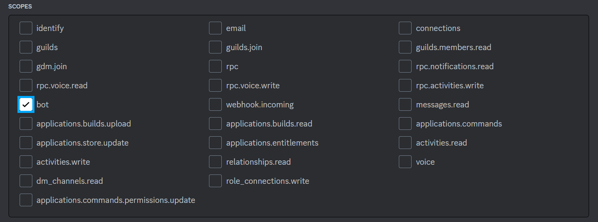
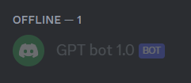

# Criação de um bot do Discord usando Node.js, Discord.js e OpenAI GPT-3

## Projeto

Um simples tutorial e código para construir um bot do Discord que pode responder a perguntas complexas e concluir tarefas úteis.

## Tecnologias

- Node.js
- Discord.js
- OpenAI

## Funcionalidades

- Responder a perguntas complexas
- Concluir tarefas úteis
- Auxiliar em tarefas de tradução automática;
- Gerar resumos automáticos de textos longos;
- Realizar tarefas de classificação de texto e análise de sentimentos;
- Produzir textos e conteúdos para sites e redes sociais.

## Variáveis de Ambiente

Para criar esse projeto, você vai precisar de algumas contas necessárias para adicionar as seguintes variáveis de ambiente no seu .env

- Conta do Discord (faça o download e cadastre-se [aqui](https://discord.com/))

`TOKEN_DISCORD`

- Conta beta OpenAI (inscreva-se [aqui](https://openai.com/product) )

`TOKEN_GPT`

## Preparação para o Discord

## Etapa 1: Faça login no Discord e crie um servidor

Você precisa ser o proprietário do servidor ou conhecer alguém com direitos para adicionar a conta do bot em uma etapa posterior. Você cria um novo servidor clicando no ícone “+” no menu do lado esquerdo.

## Etapa 2: Adicionar um novo aplicativo de desenvolvedor

Acesse https://discord.com/developers/applications e clique no botão "New Application" no canto superior direito para criar um novo aplicativo.


## Etapa 3: Dê um nome ao aplicativo


## Etapa 4: Criar um bot

Vá para a seção “Bot” no menu do lado esquerdo e clique em “Adicionar bot” à direita da tela.


## Etapa 5: Criar um token de bot

Clique no botão “Reset Token” para criar um novo token de bot. Este token é secreto e não deve ser compartilhado com outras pessoas. Salve-o no seu .env para uso posterior (o token é exibido apenas uma vez).


## Etapa 6: Defina o escopo e as permissões do bot.

Vá para a seção OAuth2 > URL Generator do menu de configurações.


Defina o escopo como “bot” e as permissões como "Read messages/View channels” e “Send messages”. Isso permitirá que o bot leia e escreva mensagens no chat do servidor.




## Passo 7: Copie o URL do convite e cole-o no navegador

Role mais para baixo e encontre o “URL gerado”. Vai parecer algo assim:

`https://discord.com/api/oauth2/authorize?client_id={YOUR_CLIENT_ID}&permissions=3072&scope=bot`

Cole este URL na barra de pesquisa do seu navegador. Selecione o servidor para o qual deseja autorizar o bot e clique em “Next” (“Weiter”).

Aceite as permissões necessárias e finalize clicando em “Autorizar”.

## Etapa 8: Dê as boas-vindas ao seu bot recém-criado no servidor!

Feche a guia e volte para o seu servidor. Você encontrará seu bot entre os membros do servidor se tudo correr bem.



## Etapa 9: Obter um token de API OpenAI

Acesse https://beta.openai.com/account/api-keys, faça login na sua conta OpenAI e crie sua chaves de API. Este token é secreto e não deve ser compartilhado com outras pessoas. Salve-o no seu .env para uso posterior.

## Demonstração

Fiz uma demonstração perguntando como fazer arroz para uma pessoa, tanto em português, inglês e espanhol.
Lembrasse de utilizar o **'!'** antes de cada pergunta para o bot saber que a pergunta é direcionada a ele (podendo mudar também o "simbolo especial" que quer atribuir ao bot).


## Rodando localmente

Clone o projeto

```bash
  git clone https://github.com/MatheusWill/BOT_DISCORD_GPT.git
```

Entre no diretório do projeto

```bash
  cd BOT_DISCORD_GPT
```

Instale as dependências

```bash
  npm i
```

Coloque seu bot online

```bash
  npm run server:dev
```

## Autores

- [@MatheusWill](https://github.com/MatheusWill)

## 🔗 Links

[](https://www.linkedin.com/in/matheus-w-o/)

[Documentação OpenAI](https://platform.openai.com/docs/introduction)

[Documentação Discord](https://discord.com/developers/docs/intro)

## Feedback

Se você tiver algum feedback, por favor nos deixe saber por meio de matheuswill6663@gmail.com
